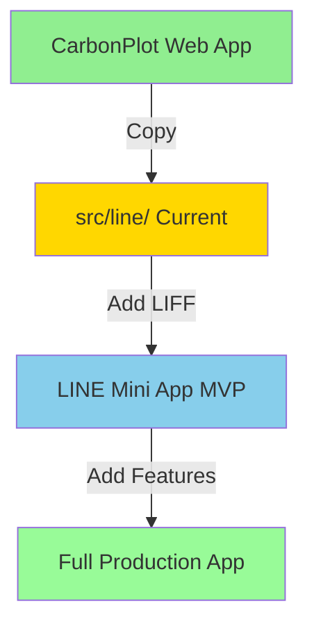
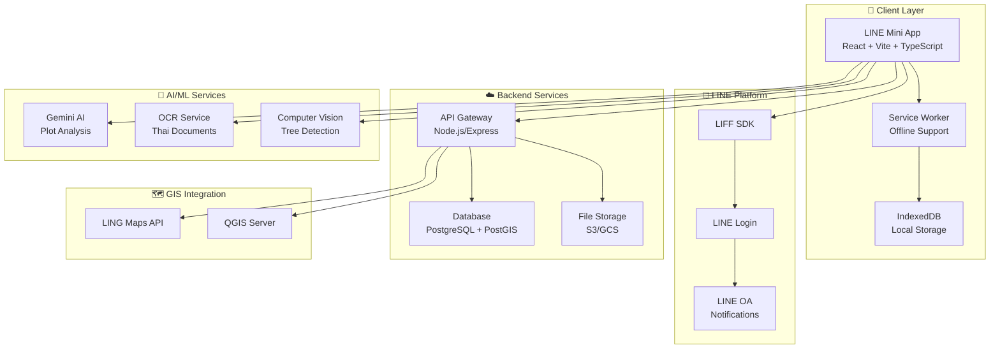
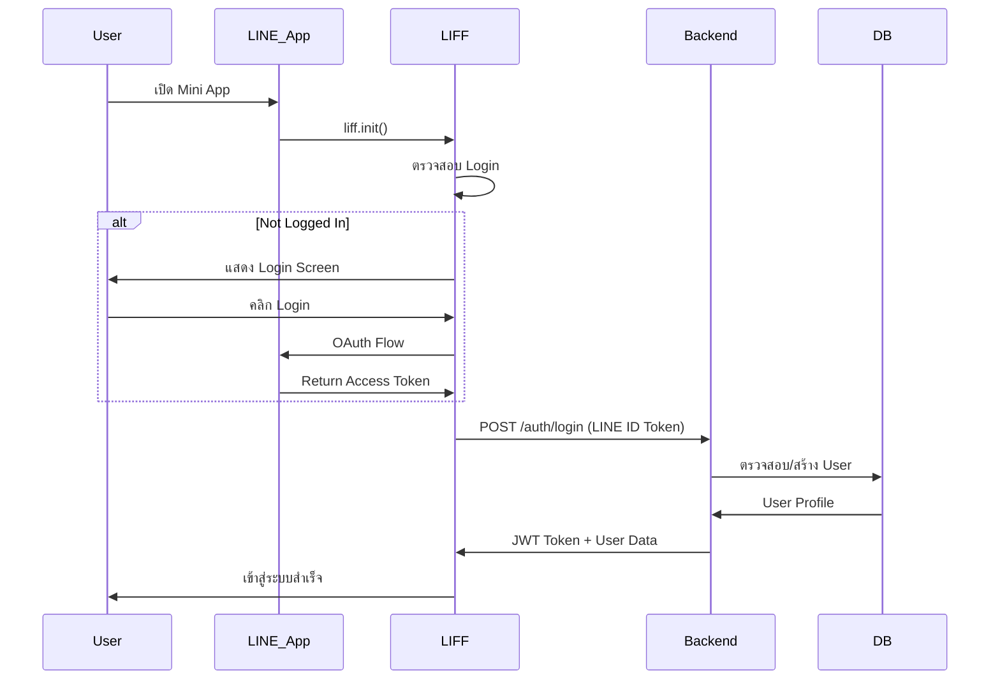
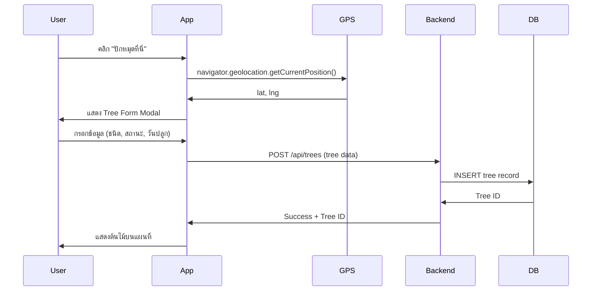
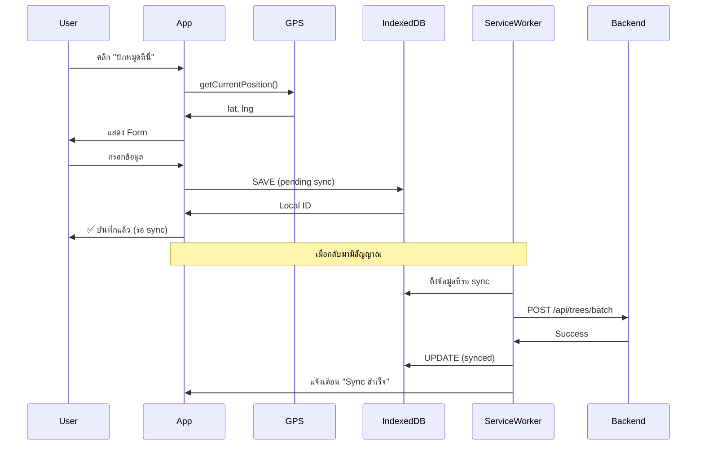
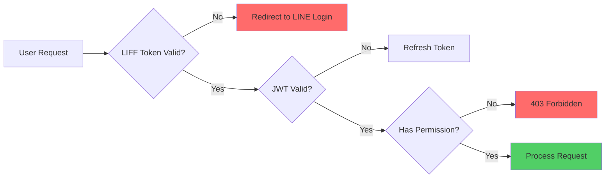
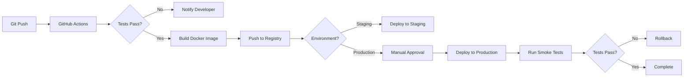

# 🌳 CarbonPlot → LINE Mini App Migration Plan
## ธนาคารต้นไม้ (Tree Bank) - Government Carbon Credit System

> **Migration Plan for Thailand Government Tree Bank Project**
> **วันที่:** February 2, 2026
> **เวอร์ชัน:** 1.0
> **สถานะ:** Ready for Implementation

---

## 📋 สารบัญ (Table of Contents)

1. [บทสรุปสำหรับผู้บริหาร (Executive Summary)](#executive-summary)
2. [สถานการณ์ปัจจุบัน (Current State Analysis)](#current-state)
3. [สถาปัตยกรรมและการตัดสินใจทางเทคนิค (Architecture Decisions)](#architecture)
4. [แผนการพัฒนาแบบเฟส (Phased Development Plan)](#phased-plan)
5. [สแต็กเทคโนโลยี (Technical Stack)](#tech-stack)
6. [โมเดลข้อมูล (Data Models)](#data-models)
7. [การเชื่อมต่อ API (API Integrations)](#api-integrations)
8. [กลยุทธ์การทดสอบและปรับใช้ (Testing & Deployment)](#testing-deployment)

---

<a name="executive-summary"></a>
## 📊 1. บทสรุปสำหรับผู้บริหาร (Executive Summary)

### 🎯 วัตถุประสงค์โครงการ (Project Objectives)

พัฒนาระบบ LINE Mini App สำหรับ**ธนาคารต้นไม้ภาครัฐ** เพื่อ:

- ✅ **ลดภาระงาน**เจ้าหน้าที่ในการจัดทำแผนที่และบันทึกข้อมูลต้นไม้
- ✅ **แทนที่ระบบเก่า** ที่มีอายุมากกว่า 70 ปี (ตั้งแต่ พ.ศ. 2492)
- ✅ **รองรับการทำงานออฟไลน์** ในพื้นที่ห่างไกลที่มีสัญญาณอ่อน
- ✅ **คำนวณคาร์บอนเครดิตอัตโนมัติ** ตามมาตรฐานภาครัฐ (9.5 กก./ต้น/ปี)
- ✅ **ตรวจสอบและรับรองได้** โดยบุคคลที่สามและหน่วยงานภาครัฐ

### 📱 ทำไมต้องเป็น LINE Mini App?

| เหตุผล | ประโยชน์ |
|--------|----------|
| **ผู้ใช้มีอยู่แล้ว** | ไม่ต้องติดตั้งแอปใหม่ เข้าถึงได้ทันทีผ่าน LINE |
| **ต้นทุนต่ำกว่า** | ไม่ต้องพัฒนา Native App แยกสำหรับ iOS และ Android |
| **อัปเดตง่าย** | ไม่ต้องรอ App Store/Play Store อนุมัติ |
| **แจ้งเตือนฟรี** | ใช้ LINE OA ส่งข้อความแจ้งเตือนไม่เสียค่าใช้จ่าย |
| **แชร์ข้อมูลง่าย** | แชร์ผลการคำนวณคาร์บอนผ่าน LINE ได้ทันที |

### 🗓️ กำหนดเวลา (Timeline)

| Phase | ระยะเวลา | Deliverable |
|-------|---------|-------------|
| **Phase 1: MVP Demo** | 1 สัปดาห์ | Demo พร้อมนำเสนอสัปดาห์หน้า |
| **Phase 2: Basic Features** | 2-3 สัปดาห์ | แอปใช้งานจริงได้ในพื้นที่ทดสอบ |
| **Phase 3: Advanced Features** | 4-6 สัปดาห์ | ฟีเจอร์เต็มรูปแบบพร้อมใช้งาน |
| **Phase 4: Pilot Deployment** | 2 สัปดาห์ | ทดลองใช้กับกลุ่มนำร่อง |
| **Phase 5: Full Rollout** | 4 สัปดาห์ | เปิดให้บริการทั่วประเทศ |

### 💰 งบประมาณโดยประมาณ (Estimated Budget)

| รายการ | งบประมาณ (บาท) | หมายเหตุ |
|--------|-----------------|----------|
| **ค่าพัฒนาซอฟต์แวร์** | 500,000 - 800,000 | 3-4 เดือน, ทีมพัฒนา 2-3 คน |
| **LINE OA Premium** | 10,000/เดือน | สำหรับ Broadcasting |
| **Cloud Hosting** | 15,000/เดือน | AWS/Google Cloud |
| **Gemini AI API** | 5,000/เดือน | สำหรับวิเคราะห์ภาพและเอกสาร |
| **LING Maps GIS** | ตามการเจรจา | หรือใช้ QGIS (ฟรี) |
| **ทดสอบและฝึกอบรม** | 100,000 | ค่าสถานที่และอุปกรณ์ |
| **รวม (ปีแรก)** | **~1,000,000** | ไม่รวมค่าบำรุงรักษาระบบเดิม |

---

<a name="current-state"></a>
## 🔍 2. สถานการณ์ปัจจุบัน (Current State Analysis)

### ✅ สิ่งที่มีอยู่แล้ว (What Exists)

#### CarbonPlot (Standalone Web App)
```
CarbonPlot/
├── App.tsx              ✅ เต็มรูปแบบ, ทำงานได้
├── types.ts             ✅ มี Plot, Tree, Document models
├── components/
│   ├── PlotMap.tsx      ✅ Leaflet map integration
│   └── TreeFormModal.tsx ✅ Tree CRUD operations
├── services/
│   └── geminiService.ts ✅ AI plot analysis
└── package.json         ✅ Dependencies complete
```

#### src/line/ (LINE Mini App - Currently Identical to CarbonPlot)
```
src/line/
├── App.tsx              🟡 Same as CarbonPlot (NO LIFF yet!)
├── types.ts             🟡 Same as CarbonPlot
├── components/          🟡 Same as CarbonPlot
├── services/            🟡 Same as CarbonPlot
└── package.json         ✅ Has @line/liff dependency
```

**🚨 Current Status:** `src/line/` is an exact copy of CarbonPlot. **LIFF integration NOT implemented yet.**

### ❌ สิ่งที่ยังขาด (What's Missing)

| ฟีเจอร์ที่ขาด | ความสำคัญ | ต้องการสำหรับ MVP? |
|---------------|-----------|---------------------|
| **LIFF SDK Integration** | 🔴 สูงสุด | ✅ ใช่ |
| **LINE Authentication** | 🔴 สูงสุด | ✅ ใช่ |
| **Offline Mode** | 🟠 สูง | ✅ ใช่ (สำหรับพื้นที่ห่างไกล) |
| **Thai Language UI** | 🟠 สูง | ✅ ใช่ |
| **Thai Land Units (ไร่-งาน-วา)** | 🟠 สูง | ✅ ใช่ |
| **Document OCR (Thai)** | 🟡 ปานกลาง | ❌ Phase 2 |
| **Aerial Photo Processing** | 🟡 ปานกลาง | ❌ Phase 3 |
| **Auto Tree Detection** | 🟡 ปานกลาง | ❌ Phase 3 |
| **Multi-layer Growth Tracking** | 🟢 ต่ำ | ❌ Phase 3 |
| **Verification Workflow** | 🟡 ปานกลาง | ❌ Phase 2 |
| **KML/KMZ Export** | 🟡 ปานกลาง | ❌ Phase 2 |
| **QGIS/LING Maps Integration** | 🟢 ต่ำ | ❌ Phase 4 |

### 📊 Gap Analysis



---

<a name="architecture"></a>
## 🏗️ 3. สถาปัตยกรรมและการตัดสินใจทางเทคนิค (Architecture Decisions)

### 🎯 คุณสมบัติหลักของสถาปัตยกรรม (Key Architecture Principles)

1. **Progressive Web App (PWA)** - รองรับออฟไลน์และติดตั้งเป็นแอปได้
2. **Offline-First** - ทำงานได้โดยไม่ต้องมีอินเทอร์เน็ตตลอดเวลา
3. **Mobile-First Design** - ออกแบบสำหรับมือถือก่อน
4. **Incremental Enhancement** - เริ่มจาก MVP แล้วค่อยเพิ่มฟีเจอร์
5. **Data Sovereignty** - ข้อมูลเก็บในประเทศไทย (compliance)

### 🗂️ สถาปัตยกรรมระดับสูง (High-Level Architecture)



### 🔄 Data Flow Architecture

#### 1. User Registration & Authentication


#### 2. Tree Registration (Online Mode)


#### 3. Tree Registration (Offline Mode)


### 🛡️ Security Architecture



### 💾 Database Schema (PostgreSQL + PostGIS)

#### Core Tables

```sql
-- Users (from LINE authentication)
CREATE TABLE users (
    id UUID PRIMARY KEY DEFAULT gen_random_uuid(),
    line_user_id VARCHAR(255) UNIQUE NOT NULL,
    display_name VARCHAR(255),
    picture_url TEXT,
    email VARCHAR(255),
    phone VARCHAR(50),
    role VARCHAR(50) DEFAULT 'member', -- member, officer, verifier, admin
    created_at TIMESTAMP DEFAULT CURRENT_TIMESTAMP,
    updated_at TIMESTAMP DEFAULT CURRENT_TIMESTAMP
);

-- Groups (กลุ่มผู้ปลูก)
CREATE TABLE groups (
    id UUID PRIMARY KEY DEFAULT gen_random_uuid(),
    name VARCHAR(255) NOT NULL,
    village VARCHAR(255),
    district VARCHAR(255),
    province VARCHAR(255),
    leader_id UUID REFERENCES users(id),
    member_count INT DEFAULT 0,
    status VARCHAR(50) DEFAULT 'pending', -- pending, approved, rejected
    created_at TIMESTAMP DEFAULT CURRENT_TIMESTAMP
);

-- Plots (แปลงที่ดิน) - GIS enabled
CREATE TABLE plots (
    id UUID PRIMARY KEY DEFAULT gen_random_uuid(),
    group_id UUID REFERENCES groups(id),
    owner_id UUID REFERENCES users(id),
    name VARCHAR(255) NOT NULL,
    deed_number VARCHAR(100), -- เลขที่โฉนด
    area_rai DECIMAL(10, 2),
    area_ngan DECIMAL(10, 2),
    area_wa DECIMAL(10, 2),
    area_sqm DECIMAL(10, 2), -- calculated from ไร่-งาน-วา
    center_point GEOGRAPHY(POINT, 4326), -- PostGIS
    boundary GEOGRAPHY(POLYGON, 4326), -- PostGIS
    status VARCHAR(50) DEFAULT 'active',
    created_at TIMESTAMP DEFAULT CURRENT_TIMESTAMP,
    updated_at TIMESTAMP DEFAULT CURRENT_TIMESTAMP
);

-- Trees (ต้นไม้)
CREATE TABLE trees (
    id UUID PRIMARY KEY DEFAULT gen_random_uuid(),
    plot_id UUID REFERENCES plots(id),
    location GEOGRAPHY(POINT, 4326), -- PostGIS
    tree_type VARCHAR(50) NOT NULL,
    status VARCHAR(50) NOT NULL, -- healthy, damaged, dead, missing
    planted_date DATE NOT NULL,
    dbh_cm DECIMAL(5, 2), -- Diameter at Breast Height (optional)
    height_m DECIMAL(5, 2), -- Height in meters (optional)
    photo_url TEXT,
    notes TEXT,
    created_at TIMESTAMP DEFAULT CURRENT_TIMESTAMP,
    updated_at TIMESTAMP DEFAULT CURRENT_TIMESTAMP
);

-- Tree History (Multi-layer tracking)
CREATE TABLE tree_history (
    id UUID PRIMARY KEY DEFAULT gen_random_uuid(),
    tree_id UUID REFERENCES trees(id),
    recorded_by UUID REFERENCES users(id),
    status VARCHAR(50),
    dbh_cm DECIMAL(5, 2),
    height_m DECIMAL(5, 2),
    photo_url TEXT,
    notes TEXT,
    recorded_at TIMESTAMP DEFAULT CURRENT_TIMESTAMP
);

-- Documents (เอกสาร)
CREATE TABLE documents (
    id UUID PRIMARY KEY DEFAULT gen_random_uuid(),
    plot_id UUID REFERENCES plots(id),
    uploaded_by UUID REFERENCES users(id),
    file_name VARCHAR(255) NOT NULL,
    file_type VARCHAR(50) NOT NULL, -- image, pdf, kml, kmz
    file_url TEXT NOT NULL,
    file_size_mb DECIMAL(8, 2),
    status VARCHAR(50) DEFAULT 'pending', -- pending, processing, verified, rejected
    ocr_result JSONB, -- Extracted data from OCR
    verified_by UUID REFERENCES users(id),
    verified_at TIMESTAMP,
    created_at TIMESTAMP DEFAULT CURRENT_TIMESTAMP
);

-- Verification Records (Third-party verification)
CREATE TABLE verifications (
    id UUID PRIMARY KEY DEFAULT gen_random_uuid(),
    plot_id UUID REFERENCES plots(id),
    verifier_id UUID REFERENCES users(id),
    verification_type VARCHAR(50), -- random_5pct, full, complaint
    scheduled_date DATE,
    completed_date DATE,
    status VARCHAR(50) DEFAULT 'scheduled', -- scheduled, in_progress, completed, failed
    trees_verified INT,
    trees_found_healthy INT,
    discrepancies JSONB,
    report_url TEXT,
    notes TEXT,
    created_at TIMESTAMP DEFAULT CURRENT_TIMESTAMP
);

-- Carbon Credits Calculation
CREATE TABLE carbon_credits (
    id UUID PRIMARY KEY DEFAULT gen_random_uuid(),
    plot_id UUID REFERENCES plots(id),
    calculation_date DATE NOT NULL,
    healthy_trees_count INT NOT NULL,
    carbon_kg_per_year DECIMAL(10, 2) NOT NULL,
    estimated_value_thb DECIMAL(10, 2), -- ราคาประมาณการ
    status VARCHAR(50) DEFAULT 'calculated', -- calculated, pending_verification, verified, issued
    verified_by UUID REFERENCES users(id),
    verified_at TIMESTAMP,
    created_at TIMESTAMP DEFAULT CURRENT_TIMESTAMP
);

-- Indexes for performance
CREATE INDEX idx_plots_location ON plots USING GIST(center_point);
CREATE INDEX idx_trees_location ON trees USING GIST(location);
CREATE INDEX idx_trees_plot_id ON trees(plot_id);
CREATE INDEX idx_documents_plot_id ON documents(plot_id);
CREATE INDEX idx_verifications_plot_id ON verifications(plot_id);
```

---

<a name="phased-plan"></a>
## 📅 4. แผนการพัฒนาแบบเฟส (Phased Development Plan)

### 🎯 Phase 1: MVP Demo (Week 1) - **สำหรับนำเสนอสัปดาห์หน้า**

**เป้าหมาย:** มี Working Demo พร้อมนำเสนอ

#### Tasks Checklist

- [ ] **1.1 LIFF Integration (2 days)**
  - [ ] เพิ่ม LIFF initialization ใน `src/line/index.tsx`
  - [ ] สร้าง `useLiff` custom hook
  - [ ] ทดสอบ Login/Logout flow
  - [ ] จัดการ Error handling สำหรับ LIFF

```typescript
// src/line/hooks/useLiff.ts
import { useState, useEffect } from 'react';
import liff from '@line/liff';

export const useLiff = () => {
  const [isLoggedIn, setIsLoggedIn] = useState(false);
  const [profile, setProfile] = useState(null);
  const [error, setError] = useState(null);
  const [isLoading, setIsLoading] = useState(true);

  useEffect(() => {
    liff
      .init({ liffId: import.meta.env.VITE_LIFF_ID })
      .then(() => {
        if (liff.isLoggedIn()) {
          setIsLoggedIn(true);
          return liff.getProfile();
        } else {
          setIsLoading(false);
          return null;
        }
      })
      .then((profileData) => {
        if (profileData) {
          setProfile(profileData);
        }
        setIsLoading(false);
      })
      .catch((err) => {
        setError(err);
        setIsLoading(false);
      });
  }, []);

  const login = () => {
    liff.login();
  };

  const logout = () => {
    liff.logout();
    setIsLoggedIn(false);
    setProfile(null);
  };

  return { isLoggedIn, profile, error, isLoading, login, logout };
};
```

- [ ] **1.2 Thai UI Updates (1 day)**
  - [ ] เปลี่ยนทุก UI เป็นภาษาไทย (ทำไปแล้วส่วนใหญ่)
  - [ ] เพิ่มหน่วยไทย (ไร่-งาน-วา) converter
  - [ ] อัปเดต tree type labels เป็นไทย

```typescript
// src/line/utils/landUnits.ts
export const raiToSqm = (rai: number, ngan: number = 0, wa: number = 0): number => {
  const RAI_TO_SQM = 1600;
  const NGAN_TO_SQM = 400;
  const WA_TO_SQM = 4;
  return (rai * RAI_TO_SQM) + (ngan * NGAN_TO_SQM) + (wa * WA_TO_SQM);
};

export const sqmToRai = (sqm: number): { rai: number; ngan: number; wa: number } => {
  const rai = Math.floor(sqm / 1600);
  const remaining = sqm % 1600;
  const ngan = Math.floor(remaining / 400);
  const wa = Math.floor((remaining % 400) / 4);
  return { rai, ngan, wa };
};
```

- [ ] **1.3 User Profile Display (1 day)**
  - [ ] แสดงข้อมูล LINE Profile ใน Header
  - [ ] เพิ่มเมนู Settings
  - [ ] เพิ่มปุ่ม Logout

- [ ] **1.4 Basic Demo Data (0.5 day)**
  - [ ] เตรียม demo data สำหรับนำเสนอ
  - [ ] Mock API responses
  - [ ] สร้าง demo scenarios

- [ ] **1.5 Demo Preparation (0.5 day)**
  - [ ] เตรียม slides นำเสนอ
  - [ ] ทดสอบ demo flow
  - [ ] จัดทำ user manual สั้นๆ

**Deliverable:** Working LINE Mini App with LIFF authentication + Thai UI

---

### 🚀 Phase 2: Core Features (Weeks 2-4)

**เป้าหมาย:** แอปใช้งานจริงได้ในพื้นที่ทดสอบ

#### Tasks Checklist

- [ ] **2.1 Offline Mode (Week 2)**
  - [ ] ติดตั้ง Service Worker
  - [ ] เพิ่ม IndexedDB สำหรับเก็บข้อมูลออฟไลน์
  - [ ] Background Sync เมื่อกลับมามีสัญญาณ
  - [ ] Cache Map Tiles สำหรับใช้งานออฟไลน์

```typescript
// src/line/db/indexedDB.ts
import Dexie, { Table } from 'dexie';

export interface OfflineTree {
  id?: number;
  tempId: string;
  lat: number;
  lng: number;
  type: string;
  status: string;
  plantedDate: string;
  synced: boolean;
  createdAt: number;
}

export class CarbonPlotDB extends Dexie {
  trees!: Table<OfflineTree>;

  constructor() {
    super('CarbonPlotDB');
    this.version(1).stores({
      trees: '++id, tempId, synced, createdAt'
    });
  }
}

export const db = new CarbonPlotDB();
```

- [ ] **2.2 Backend API Development (Weeks 2-3)**
  - [ ] Setup Node.js + Express server
  - [ ] ติดตั้ง PostgreSQL + PostGIS
  - [ ] สร้าง REST API endpoints:
    - `POST /api/auth/login` - LINE authentication
    - `GET /api/users/me` - Get current user
    - `POST /api/plots` - Create plot
    - `GET /api/plots/:id` - Get plot details
    - `POST /api/trees` - Add tree
    - `PUT /api/trees/:id` - Update tree
    - `DELETE /api/trees/:id` - Delete tree
    - `POST /api/trees/batch` - Batch sync from offline
    - `GET /api/plots/:id/carbon` - Calculate carbon credits

- [ ] **2.3 Document Upload (Week 3)**
  - [ ] ติดตั้ง file upload (S3/Google Cloud Storage)
  - [ ] สร้าง upload UI สำหรับโฉนดที่ดิน
  - [ ] Preview documents
  - [ ] Document management (list, delete)

- [ ] **2.4 Registration Workflow (Week 4)**
  - [ ] หน้า Registration Form (ลงทะเบียนกลุ่ม)
  - [ ] Validation rules (minimum 9 trees per group)
  - [ ] Document submission
  - [ ] Status tracking (pending, approved, rejected)

**Deliverable:** Fully functional app with offline support + backend API

---

### 🎨 Phase 3: Advanced Features (Weeks 5-10)

**เป้าหมาย:** ฟีเจอร์ครบตามความต้องการ

#### Tasks Checklist

- [ ] **3.1 Thai OCR Integration (Weeks 5-6)**
  - [ ] เลือก OCR service (Google Vision, AWS Textract, หรือ PaddleOCR)
  - [ ] ดึงข้อมูลจากโฉนดที่ดิน:
    - เลขที่โฉนด
    - ชื่อเจ้าของ
    - ตำบล/อำเภอ/จังหวัด
    - เนื้อที่ (ไร่-งาน-วา)
  - [ ] Auto-fill form จากผล OCR
  - [ ] Manual correction UI

- [ ] **3.2 Aerial Photo Processing (Weeks 7-8)**
  - [ ] รับอัปโหลดภาพถ่ายทางอากาศ
  - [ ] Crop และ enhance ภาพ
  - [ ] Map extraction (ตัดส่วนแผนที่ออกจากเอกสาร)
  - [ ] Georeferencing (แปลงพิกัดบนโฉนดเป็น GPS)

- [ ] **3.3 AI Tree Detection (Weeks 8-9)**
  - [ ] ใช้ Computer Vision ตรวจจับต้นไม้จากภาพถ่ายทางอากาศ
  - [ ] Auto-plot ตำแหน่งต้นไม้บนแผนที่
  - [ ] Manual adjustment UI
  - [ ] Batch import trees from detection results

- [ ] **3.4 Multi-layer Tracking (Week 9)**
  - [ ] Tree history table
  - [ ] Record DBH measurements over time
  - [ ] Growth visualization (charts)
  - [ ] Compare historical data

- [ ] **3.5 KML/KMZ Support (Week 10)**
  - [ ] Parse KML/KMZ files
  - [ ] Extract boundary polygons
  - [ ] Import plot boundaries
  - [ ] Export plot data as KML/KMZ

**Deliverable:** Advanced feature-complete app

---

### 🧪 Phase 4: Verification & Integration (Weeks 11-12)

**เป้าหมาย:** ระบบตรวจสอบและเชื่อมต่อกับหน่วยงานภาครัฐ

#### Tasks Checklist

- [ ] **4.1 Verification Workflow (Week 11)**
  - [ ] Third-party verifier role
  - [ ] Random sampling (5% selection)
  - [ ] Verification checklist
  - [ ] Photo evidence upload
  - [ ] Report generation
  - [ ] Approval/Rejection flow

- [ ] **4.2 Dashboard for Officials (Week 11)**
  - [ ] Overview statistics (total plots, trees, carbon credits)
  - [ ] Verification queue
  - [ ] Pending applications
  - [ ] Export reports (PDF, Excel)

- [ ] **4.3 GIS Integration (Week 12)**
  - [ ] LING Maps API integration (if available)
  - [ ] QGIS data export
  - [ ] WMS/WFS layer publishing
  - [ ] Coordinate transformation (UTM ↔ WGS84)

- [ ] **4.4 Data Migration (Week 12)**
  - [ ] Export tool for legacy system
  - [ ] CSV/Excel export
  - [ ] Batch data import from old database

**Deliverable:** Production-ready app with verification and integration

---

### 🚢 Phase 5: Deployment & Training (Weeks 13-16)

**เป้าหมาย:** เปิดให้บริการและฝึกอบรมผู้ใช้

#### Tasks Checklist

- [ ] **5.1 Pilot Deployment (Weeks 13-14)**
  - [ ] เลือกพื้นที่นำร่อง (1-2 จังหวัด)
  - [ ] เชิญผู้ใช้ทดสอบ (50-100 คน)
  - [ ] รวบรวม feedback
  - [ ] แก้ไข bugs

- [ ] **5.2 Training Materials (Week 14)**
  - [ ] User manual (PDF)
  - [ ] Video tutorials (YouTube)
  - [ ] FAQ document
  - [ ] LINE OA chatbot for support

- [ ] **5.3 Field Training (Week 15)**
  - [ ] จัดอบรมเจ้าหน้าที่ภาคสนาม
  - [ ] Demo การใช้งานจริง
  - [ ] รวบรวมคำถาม
  - [ ] ปรับปรุงจากข้อเสนอแนะ

- [ ] **5.4 Full Rollout (Week 16)**
  - [ ] เปิดให้บริการทั่วประเทศ
  - [ ] ประชาสัมพันธ์ผ่าน LINE OA
  - [ ] ติดตามการใช้งาน
  - [ ] Support team standby

**Deliverable:** Fully deployed production app with training complete

---

<a name="tech-stack"></a>
## 🛠️ 5. สแต็กเทคโนโลยี (Technical Stack)

### Frontend

| Technology | Version | Purpose |
|-----------|---------|---------|
| **React** | 19.2.4 | UI framework |
| **TypeScript** | 5.8.2 | Type safety |
| **Vite** | 6.2.0 | Build tool & dev server |
| **@line/liff** | 2.23.2 | LINE LIFF SDK |
| **Leaflet** | 1.9.4 | Interactive maps |
| **Recharts** | 3.7.0 | Data visualization |
| **Lucide React** | 0.563.0 | Icon library |
| **Dexie.js** | 3.x | IndexedDB wrapper (offline) |
| **Workbox** | 7.x | Service Worker utilities |
| **i18next** | 23.x | Internationalization (Thai/English) |

### Backend

| Technology | Purpose |
|-----------|---------|
| **Node.js** v20 LTS | Runtime |
| **Express** | Web framework |
| **PostgreSQL** 15 | Database |
| **PostGIS** | GIS extension |
| **Prisma** | ORM |
| **JWT** | Authentication |
| **Multer** | File upload |
| **Sharp** | Image processing |

### Cloud & Infrastructure

| Service | Provider | Purpose |
|---------|----------|---------|
| **Hosting** | AWS/Google Cloud | VM instances |
| **Database** | AWS RDS / Cloud SQL | PostgreSQL hosting |
| **File Storage** | AWS S3 / Google Cloud Storage | Document & image storage |
| **CDN** | CloudFront / Cloud CDN | Static assets |
| **Monitoring** | Datadog / Cloud Logging | Application monitoring |

### AI/ML Services

| Service | Purpose | Cost |
|---------|---------|------|
| **Google Gemini API** | Plot analysis | ~5,000 THB/month |
| **Google Cloud Vision** | OCR (Thai) | ~3,000 THB/month |
| **Custom CV Model** | Tree detection (optional) | One-time training cost |

### GIS Services

| Service | Cost | Notes |
|---------|------|-------|
| **LING Maps** | TBD | Commercial GIS platform |
| **QGIS** | Free | Open source alternative |
| **Leaflet** | Free | Map rendering |
| **OpenStreetMap** | Free | Base map tiles |

---

<a name="data-models"></a>
## 📊 6. โมเดลข้อมูล (Extended Data Models)

### TypeScript Interfaces (Frontend)

```typescript
// src/line/types.ts

export enum TreeStatus {
  HEALTHY = 'Healthy',
  DAMAGED = 'Damaged',
  DEAD = 'Dead',
  MISSING = 'Missing'
}

export enum TreeType {
  TEAK = 'Teak',           // สัก
  MAHOGANY = 'Mahogany',   // ยางนา
  RUBBER = 'Rubber',       // ยางพารา
  OTHER = 'Other'          // อื่นๆ
}

export interface Tree {
  id: string;
  lat: number;
  lng: number;
  type: TreeType;
  status: TreeStatus;
  plantedDate: string;
  dbhCm?: number;          // Diameter at Breast Height (optional)
  heightM?: number;        // Height in meters (optional)
  photoUrl?: string;
  notes?: string;
  createdAt?: string;
  updatedAt?: string;
}

export interface TreeHistory {
  id: string;
  treeId: string;
  recordedBy: string;      // User ID
  status: TreeStatus;
  dbhCm?: number;
  heightM?: number;
  photoUrl?: string;
  notes?: string;
  recordedAt: string;
}

export interface PlotDocument {
  id: string;
  name: string;
  size: string;
  type: 'kml' | 'kmz' | 'image' | 'pdf';
  uploadDate: string;
  status: 'pending' | 'processing' | 'verified' | 'rejected';
  url?: string;
  ocrResult?: {            // Extracted from OCR
    deedNumber?: string;
    ownerName?: string;
    province?: string;
    district?: string;
    subDistrict?: string;
    areaRai?: number;
    areaNgan?: number;
    areaWa?: number;
  };
}

export interface Plot {
  id: string;
  name: string;
  location: string;
  centerLat: number;
  centerLng: number;
  areaRai: number;
  areaNgan?: number;
  areaWa?: number;
  areaSqm: number;         // Calculated from ไร่-งาน-วา
  boundary?: { lat: number; lng: number }[];
  trees: Tree[];
  documents: PlotDocument[];
  groupId?: string;
  ownerId: string;
  status: 'active' | 'pending' | 'verified' | 'suspended';
  createdAt: string;
  updatedAt: string;
}

export interface Group {
  id: string;
  name: string;
  village: string;
  district: string;
  province: string;
  leaderId: string;
  memberCount: number;
  status: 'pending' | 'approved' | 'rejected';
  createdAt: string;
}

export interface User {
  id: string;
  lineUserId: string;
  displayName: string;
  pictureUrl?: string;
  email?: string;
  phone?: string;
  role: 'member' | 'officer' | 'verifier' | 'admin';
  groupId?: string;
  createdAt: string;
}

export interface CarbonCredit {
  id: string;
  plotId: string;
  calculationDate: string;
  healthyTreesCount: number;
  carbonKgPerYear: number;
  estimatedValueThb?: number;
  status: 'calculated' | 'pending_verification' | 'verified' | 'issued';
  verifiedBy?: string;
  verifiedAt?: string;
  createdAt: string;
}

export interface Verification {
  id: string;
  plotId: string;
  verifierId: string;
  verificationType: 'random_5pct' | 'full' | 'complaint';
  scheduledDate?: string;
  completedDate?: string;
  status: 'scheduled' | 'in_progress' | 'completed' | 'failed';
  treesVerified: number;
  treesFoundHealthy: number;
  discrepancies?: any;
  reportUrl?: string;
  notes?: string;
  createdAt: string;
}

export const CARBON_CREDIT_FACTOR = 9.5; // kg per tree per year
export const CARBON_MARKET_PRICE_THB = 300; // THB per kg (approximate)
```

---

<a name="api-integrations"></a>
## 🔌 7. การเชื่อมต่อ API (API Integrations)

### REST API Endpoints

#### Authentication

```http
POST /api/auth/login
Content-Type: application/json

{
  "lineIdToken": "eyJhbGc...",
  "liffAccessToken": "Bearer ..."
}

Response:
{
  "token": "jwt_token_here",
  "user": {
    "id": "uuid",
    "lineUserId": "U1234567890abcdef",
    "displayName": "สมชาย ใจดี",
    "pictureUrl": "https://...",
    "role": "member"
  }
}
```

#### Plots

```http
# Get all plots for current user
GET /api/plots
Authorization: Bearer {jwt_token}

Response:
{
  "plots": [...],
  "total": 10
}

# Get plot by ID
GET /api/plots/{plotId}
Authorization: Bearer {jwt_token}

# Create plot
POST /api/plots
Content-Type: application/json
Authorization: Bearer {jwt_token}

{
  "name": "แปลง A",
  "areaRai": 5,
  "areaNgan": 2,
  "areaWa": 50,
  "centerLat": 18.7883,
  "centerLng": 98.9853,
  "boundary": [...]
}

# Update plot
PUT /api/plots/{plotId}
Authorization: Bearer {jwt_token}

# Delete plot
DELETE /api/plots/{plotId}
Authorization: Bearer {jwt_token}
```

#### Trees

```http
# Add tree
POST /api/trees
Content-Type: application/json
Authorization: Bearer {jwt_token}

{
  "plotId": "uuid",
  "lat": 18.7883,
  "lng": 98.9853,
  "type": "Teak",
  "status": "Healthy",
  "plantedDate": "2024-01-15",
  "dbhCm": 25.5,
  "photoUrl": "https://..."
}

# Batch sync (offline mode)
POST /api/trees/batch
Content-Type: application/json
Authorization: Bearer {jwt_token}

{
  "trees": [
    {...},
    {...}
  ]
}

# Update tree
PUT /api/trees/{treeId}

# Delete tree
DELETE /api/trees/{treeId}

# Get tree history
GET /api/trees/{treeId}/history
```

#### Documents

```http
# Upload document
POST /api/documents/upload
Content-Type: multipart/form-data
Authorization: Bearer {jwt_token}

FormData:
  file: (binary)
  plotId: "uuid"
  type: "image" | "pdf" | "kml" | "kmz"

# Trigger OCR processing
POST /api/documents/{docId}/ocr
Authorization: Bearer {jwt_token}

Response:
{
  "ocrResult": {
    "deedNumber": "123456",
    "ownerName": "นายสมชาย ใจดี",
    "province": "เชียงใหม่",
    ...
  }
}
```

#### Carbon Credits

```http
# Calculate carbon credits
GET /api/plots/{plotId}/carbon
Authorization: Bearer {jwt_token}

Response:
{
  "plotId": "uuid",
  "calculationDate": "2026-02-02",
  "healthyTreesCount": 150,
  "carbonKgPerYear": 1425.0,
  "estimatedValueThb": 427500,
  "formula": "150 trees × 9.5 kg/tree/year = 1425 kg/year"
}
```

#### Verification

```http
# Schedule verification
POST /api/verifications
Content-Type: application/json
Authorization: Bearer {jwt_token}

{
  "plotId": "uuid",
  "verificationType": "random_5pct",
  "scheduledDate": "2026-03-01"
}

# Get verification details
GET /api/verifications/{verificationId}

# Submit verification report
PUT /api/verifications/{verificationId}/complete
Content-Type: application/json
Authorization: Bearer {jwt_token}

{
  "treesVerified": 8,
  "treesFoundHealthy": 7,
  "discrepancies": {...},
  "reportUrl": "https://...",
  "notes": "..."
}
```

---

<a name="testing-deployment"></a>
## 🧪 8. กลยุทธ์การทดสอบและปรับใช้ (Testing & Deployment)

### Testing Strategy

#### 1. Unit Testing
```bash
# Jest + React Testing Library
npm run test

# Coverage report
npm run test:coverage
```

**Target Coverage:** > 80% for critical paths

#### 2. Integration Testing
- API endpoint testing with Supertest
- Database integration tests
- LIFF SDK integration tests

#### 3. E2E Testing
```bash
# Playwright/Cypress
npm run test:e2e
```

**Test Scenarios:**
- User registration flow
- Tree creation (online & offline)
- Document upload and OCR
- Carbon credit calculation
- Verification workflow

#### 4. Field Testing
- **Location:** 2-3 pilot provinces
- **Users:** 50-100 farmers and 5-10 officers
- **Duration:** 2 weeks
- **Metrics:**
  - App crashes
  - Offline sync success rate
  - GPS accuracy
  - OCR accuracy (Thai documents)
  - User satisfaction score

### Deployment Strategy

#### CI/CD Pipeline



#### Environments

| Environment | Purpose | URL |
|------------|---------|-----|
| **Development** | Local development | http://localhost:3000 |
| **Staging** | QA testing | https://staging.treebank.go.th |
| **Production** | Live app | https://liff.line.me/{liff-id} |

#### Deployment Checklist

- [ ] Run all tests (unit, integration, E2E)
- [ ] Build production bundle (`npm run build`)
- [ ] Verify environment variables
- [ ] Database migrations (if any)
- [ ] Backup current database
- [ ] Deploy to staging first
- [ ] Run smoke tests on staging
- [ ] Get approval from stakeholders
- [ ] Deploy to production
- [ ] Monitor error logs (first 24 hours)
- [ ] Notify users via LINE OA

### Monitoring & Maintenance

#### Application Monitoring

```typescript
// Error tracking with Sentry
import * as Sentry from "@sentry/react";

Sentry.init({
  dsn: "https://...",
  environment: import.meta.env.MODE,
  tracesSampleRate: 1.0,
});
```

#### Metrics to Track

| Metric | Target | Tool |
|--------|--------|------|
| **Uptime** | > 99.5% | UptimeRobot |
| **Response Time (API)** | < 500ms (p95) | Datadog |
| **Error Rate** | < 0.1% | Sentry |
| **Offline Sync Success** | > 95% | Custom Analytics |
| **GPS Accuracy** | ±5m (p90) | Custom Analytics |
| **OCR Accuracy (Thai)** | > 85% | Manual Review |

---

## 📞 Support & Contact

| Role | Name | Contact |
|------|------|---------|
| **Project Manager** | TBD | LINE: @treebank |
| **Lead Developer** | TBD | dev@treebank.go.th |
| **Technical Support** | LINE OA | @treebankth |
| **Government Liaison** | TBD | gov@treebank.go.th |

---

## 📚 References

- [LINE LIFF Documentation](https://developers.line.biz/en/docs/liff/)
- [Leaflet GIS Documentation](https://leafletjs.com/)
- [PostGIS Documentation](https://postgis.net/documentation/)
- [QGIS User Guide](https://docs.qgis.org/)
- [LING Maps Website](https://lingmaps.com/)
- [Google Gemini API](https://ai.google.dev/gemini-api/docs)
- [Google Cloud Vision OCR](https://cloud.google.com/vision/docs/ocr)

---

## ✅ Next Steps

1. **Review this plan** with stakeholders
2. **Set up development environment** (LIFF ID, database, cloud accounts)
3. **Start Phase 1 immediately** (target: demo ready in 7 days)
4. **Schedule weekly check-ins** for progress updates
5. **Prepare demo scenario** for next week's presentation

---

**Last Updated:** February 2, 2026
**Version:** 1.0
**Status:** Ready for Implementation ✅

